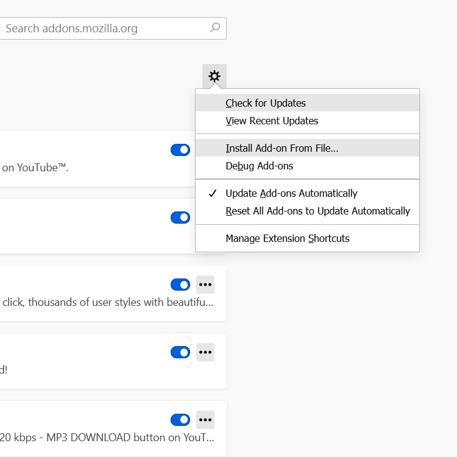

A Simple daily one time alarm for reminders...  
Plays a soft sound for a few seconds when alarm goes off.  
Made with vanilla js, uses tabs permissions to communicate to a background script.  
No special code for playing the sound.  

Mostly a proof of concept, WIP, feel free to clone, remix, fork, etc :P  
(install instructions below)  

To install manually, download the .xpi file,  
click the menu button in firefox, selct add-ons, and click the settings wheel.  

